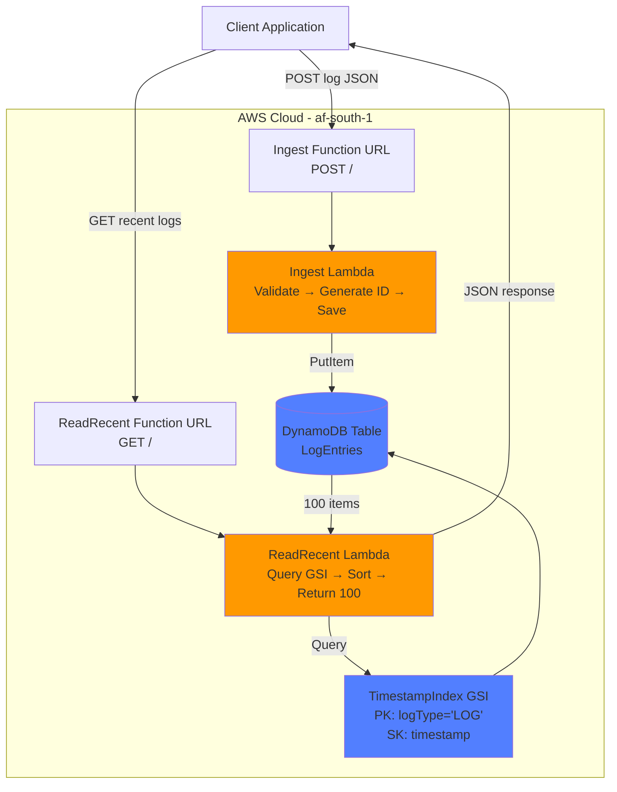
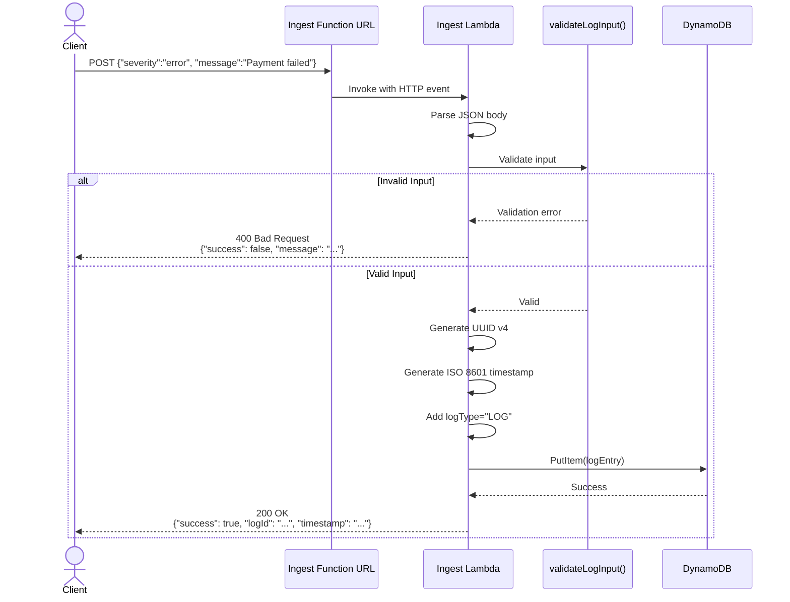
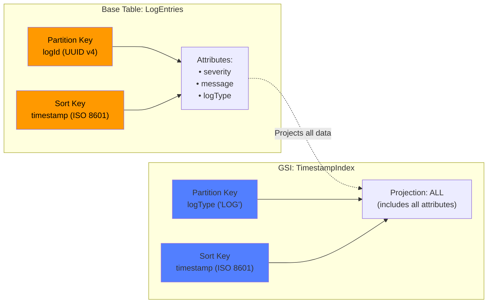
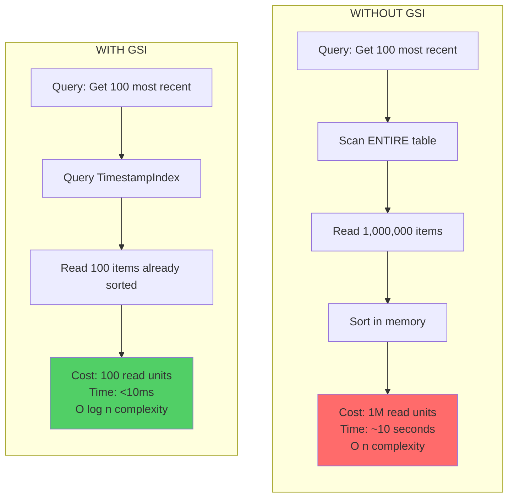

# AWS Serverless Log Service

> **A production-ready serverless logging system demonstrating cloud architecture, efficient database design, and AWS best practices.**

Built for the **Games Global Graduate Developer Assessment 2025**, this project showcases a fully serverless approach to log ingestion and retrieval using modern AWS services and Infrastructure as Code.

## Project Goal

Design and implement a scalable log service that:
- Accepts log entries via a public API
- Stores logs efficiently in a managed database
- Retrieves the 100 most recent logs sorted by timestamp
- Demonstrates AWS serverless architecture patterns
- Costs <$3/month for 1 million logs (vs $45+ for traditional databases)

## Quick Start
```bash
git clone https://github.com/ST10145498/log-service-aws.git
cd log-service-aws
npm install
cdk deploy  # Deploys in ~3 minutes
```

After deployment, you'll receive two HTTPS endpoints ready to use immediately.

## Key Features

- **Fully Serverless** - Zero server management, auto-scales from 0 to 1000s of requests/second
- **Infrastructure as Code** - Complete AWS CDK implementation in TypeScript
- **Optimized Performance** - O(log n) queries using DynamoDB Global Secondary Index
- **Cost-Efficient** - DynamoDB on-demand pricing (~$2-3 per million logs)
- **Production-Ready** - Input validation, error handling, CloudWatch monitoring
- **Type-Safe** - Full TypeScript implementation with strict typing

## What This Demonstrates

**Cloud Architecture:**
- Serverless design patterns (Lambda + DynamoDB)
- API design with Lambda Function URLs
- Database schema optimization for time-series data
- Infrastructure as Code with AWS CDK

**Technical Skills:**
- TypeScript development (Node.js 20)
- AWS SDK v3 usage
- DynamoDB query optimization with GSI
- Input validation and error handling
- Professional documentation

**AWS Services:**
- AWS Lambda (compute layer)
- DynamoDB (NoSQL database)
- IAM (security & permissions)
- CloudWatch (logging & monitoring)
- Lambda Function URLs (HTTP API)

## Overview

This service provides two simple APIs:
- **Ingest API**: POST logs with severity (`info`/`warning`/`error`) and message
- **ReadRecent API**: GET the 100 most recent log entries (newest first)

**Example Usage:**
```bash
# Create a log entry
curl -X POST https://YOUR-INGEST-URL.lambda-url.af-south-1.on.aws/ \
  -H "Content-Type: application/json" \
  -d '{"severity":"error","message":"Payment processing failed"}'

# Retrieve recent logs
curl https://YOUR-READRECENT-URL.lambda-url.af-south-1.on.aws/
```

---

## Architecture Explanation

### System Architecture

This solution implements a fully serverless architecture using AWS managed services:


**System Components:**

**API Layer:**
- Two Lambda Function URLs providing public HTTPS endpoints
- Ingest Function URL: Accepts POST requests to create logs
- ReadRecent Function URL: Accepts GET requests to retrieve logs

**Compute Layer:**
- Ingest Lambda: Node.js 20 TypeScript function (256MB, 30s timeout)
- ReadRecent Lambda: Node.js 20 TypeScript function (256MB, 30s timeout)

**Data Layer:**
- DynamoDB Table: "LogEntries" with on-demand billing
- Global Secondary Index: "TimestampIndex" for efficient time-based queries

**Security:**
- IAM roles with least-privilege permissions
- CloudWatch Logs for Lambda execution logging

### Architecture Flow

**Write Path (Creating a Log Entry):**


The Ingest Lambda (`src/lambdas/ingest/index.ts`) performs these operations:

1. **Request Parsing**: Extracts JSON body from the HTTP POST request
2. **Input Validation**: Uses `validateLogInput()` from `src/utils/validator.ts` to check:
   - Severity is present and one of: `info`, `warning`, `error`
   - Message is present and not empty
3. **ID Generation**: Creates a unique UUID v4 using the `uuid` package
4. **Timestamp Generation**: Creates ISO 8601 timestamp using `new Date().toISOString()`
5. **DynamoDB Write**: Saves the complete log entry using AWS SDK v3's `PutCommand`
6. **Response**: Returns HTTP 200 with the generated `logId` and `timestamp`

**Read Path (Retrieving Recent Logs):**

The ReadRecent Lambda (`src/lambdas/read-recent/index.ts`) retrieves logs efficiently:

1. **Client Request**: Receives HTTP GET request (no body required)
2. **DynamoDB Query**: Queries using the `TimestampIndex` GSI with:
   - `KeyConditionExpression: 'logType = :logType'` (queries all logs)
   - `ScanIndexForward: false` (sorts newest first)
   - `Limit: 100` (returns exactly 100 entries)
3. **Response Formatting**: Returns JSON with count and logs array
4. **HTTP Response**: Returns HTTP 200 with formatted data

### Why This Architecture?

**Serverless Benefits:**
- No servers to provision, patch, or manage
- Automatic scaling based on request volume
- Pay only for actual requests (no idle costs)
- High availability built-in across AWS availability zones

**Lambda Function URLs vs API Gateway:**
- Simpler architecture (no additional service)
- Lower latency (one less hop)
- No additional costs
- Sufficient for simple CRUD operations

**Separation of Concerns:**
- Validation logic isolated in `src/utils/validator.ts`
- Data models defined in `src/models/log-entry.ts`
- Lambda handlers focus only on request/response
- Infrastructure completely separated in `lib/log-service-aws-stack.ts`

## Database Design Explanation

### DynamoDB Table Structure


**Table Name**: `LogEntries`

**Primary Key Design:**

The table uses a composite primary key:

**Partition Key: `logId` (String)**
- Contains UUID v4 values (e.g., `"17fb2d04-a9aa-43d9-a95a-a0c3a3a0aa9c"`)
- Generated server-side using the `uuid` npm package
- Random distribution ensures writes spread evenly across DynamoDB partitions
- Prevents hot partitions and maximizes write throughput

**Sort Key: `timestamp` (String)**
- Contains ISO 8601 timestamps (e.g., `"2025-10-25T14:19:48.337Z"`)
- Generated server-side using `new Date().toISOString()`
- Lexicographically sortable (string comparison works for time-based sorting)
- Human-readable in DynamoDB console

**Attributes Schema:**
```typescript
interface LogEntry {
  logId: string;        // Primary partition key
  timestamp: string;    // Primary sort key
  severity: string;     // "info" | "warning" | "error"
  message: string;      // The actual log message text
  logType: string;      // Always "LOG" - used for GSI queries
}
```

**Example Record:**
```json
{
  "logId": "17fb2d04-a9aa-43d9-a95a-a0c3a3a0aa9c",
  "timestamp": "2025-10-25T14:19:48.337Z",
  "severity": "error",
  "message": "Payment processing failed",
  "logType": "LOG"
}
```

### Global Secondary Index Design

**Index Name**: `TimestampIndex`

**Purpose**: Enable efficient queries for "most recent 100 logs" without scanning the entire table.

**GSI Structure:**

**Partition Key: `logType` (String)**
- Value: Always `"LOG"` (constant for all entries)
- Purpose: Groups ALL log entries under a single partition key
- Enables querying all logs together

**Sort Key: `timestamp` (String)**
- Same ISO 8601 timestamp from the base table
- Enables sorting by time in the query

**Projection Type**: `ALL`
- Includes ALL attributes from the base table
- Eliminates need for additional queries
- Improves read performance at the cost of additional storage

### Why This Database Design?

**Problem: Random UUIDs Don't Support Time Queries**

If we only had the primary key (`logId`), we'd have no way to query "most recent logs" because:
- UUIDs are random with no chronological ordering
- We'd need to scan the ENTIRE table and sort in memory (O(n) operation)
- Very expensive and slow for large datasets

**Solution: Global Secondary Index**


The GSI solves this by:
1. Grouping all logs under one partition key (`logType = "LOG"`)
2. Using timestamp as the sort key for efficient time-based queries
3. Enabling: "Get all items where logType='LOG', sorted by timestamp, limit 100"

**Query Code:**
```typescript
await dynamoDB.send(new QueryCommand({
  TableName: 'LogEntries',
  IndexName: 'TimestampIndex',
  KeyConditionExpression: 'logType = :logType',
  ExpressionAttributeValues: { ':logType': 'LOG' },
  ScanIndexForward: false,  // false = descending (newest first)
  Limit: 100
}));
```

### Data Integrity

**Server-Side Generation:**
- `logId` generated by Lambda (client cannot provide it)
- `timestamp` generated by Lambda (client cannot provide it)
- Prevents duplicate IDs or incorrect timestamps

**Input Validation** (`src/utils/validator.ts`):
- Severity must be exactly: `"info"`, `"warning"`, or `"error"`
- Message must be present and non-empty
- Request body must be valid JSON
- Ensures only valid data enters the database

### Why DynamoDB Over Alternatives?

**DynamoDB vs RDS/Aurora:**

| Feature | DynamoDB | RDS/Aurora |
|---------|----------|------------|
| **Management** | Fully managed, zero ops | Requires instance sizing, patching |
| **Scaling** | Automatic with on-demand mode | Manual scaling, capacity planning |
| **Cost (1M logs/month)** | ~$2-3 | ~$45 minimum |
| **Latency** | Single-digit milliseconds | 10-50ms typical |
| **Serverless** | True serverless | Aurora Serverless has cold starts |
| **Query Flexibility** | Simple queries only | Full SQL support |
| **Use Case Fit** | Perfect for key-value + GSI | Overkill for simple CRUD |

**For This Use Case:**

Requirements:
- Insert log entries (simple write)
- Query 100 most recent entries (simple time-based query)
- No complex joins or transactions needed
- Cost-effective for variable load

**Conclusion**: DynamoDB provides exactly what's needed (simple reads/writes with time-based queries) at the lowest cost with zero operational overhead.

### Scalability

**Current Design Supports:**
- 1,000 writes/second (DynamoDB on-demand)
- 3,000 reads/second (GSI on-demand)
- Essentially unlimited storage

**For Production Scale:**
- Consider date-based partitioning: `logType = "LOG#2025-10-25"`
- Implement DynamoDB TTL for automatic cleanup
- Add pagination for results > 100 logs

## Technology Stack

- **Infrastructure**: AWS CDK (TypeScript)
- **Compute**: AWS Lambda (Node.js 20)
- **Database**: Amazon DynamoDB
- **API**: Lambda Function URLs
- **Language**: TypeScript

## Prerequisites

- Node.js 18+ installed
- AWS CLI configured with credentials
- AWS CDK installed globally (`npm install -g aws-cdk`)
- An AWS account

## How to Deploy the Lambdas

### Step 1: Clone the Repository
```bash
git clone https://github.com/ST10145498/log-service-aws.git
cd log-service-aws
```

### Step 2: Install Dependencies
```bash
npm install
```

This installs:
- `aws-cdk-lib` - CDK framework
- `@aws-sdk/client-dynamodb` - DynamoDB SDK v3
- `@aws-sdk/lib-dynamodb` - DynamoDB Document Client
- `uuid` - UUID generation
- TypeScript and type definitions

### Step 3: Bootstrap AWS CDK (First Time Only)
```bash
cdk bootstrap
```

This creates:
- S3 bucket for storing CDK assets
- IAM roles for CDK deployments
- CloudFormation stack named `CDKToolkit`

Output:
```
Environment aws://YOUR_ACCOUNT_ID/af-south-1 bootstrapped.
```

### Step 4: Deploy to AWS
```bash
cdk deploy
```

What happens:
1. TypeScript compilation
2. Lambda code bundling with esbuild
3. CloudFormation template synthesis
4. Asset upload to S3
5. Security prompt (type `y` to confirm)
6. Resource creation (3-5 minutes):
   - DynamoDB table with GSI
   - IAM roles and policies
   - Lambda functions
   - Lambda Function URLs
   - CloudWatch Log Groups

Deployment output:
```
LogServiceAwsStack

Outputs:
LogServiceAwsStack.IngestLambdaUrl = https://YOUR-INGEST-URL.lambda-url.af-south-1.on.aws/
LogServiceAwsStack.ReadRecentLambdaUrl = https://YOUR-READRECENT-URL.lambda-url.af-south-1.on.aws/
LogServiceAwsStack.TableName = LogEntries

Deployment time: 73.44s
```

**Save these URLs** - you'll need them to run the Lambdas.

### What Gets Deployed

The `cdk deploy` command creates:

1. **DynamoDB Table**: `LogEntries`
   - Primary key: `logId` (partition), `timestamp` (sort)
   - GSI: `TimestampIndex`
   - Billing: On-demand
   - Region: af-south-1

2. **Lambda Function**: `LogService-Ingest`
   - Runtime: Node.js 20
   - Code: Bundled from `src/lambdas/ingest/index.ts`
   - Environment: `TABLE_NAME=LogEntries`
   - IAM: DynamoDB write permissions

3. **Lambda Function**: `LogService-ReadRecent`
   - Runtime: Node.js 20
   - Code: Bundled from `src/lambdas/read-recent/index.ts`
   - Environment: `TABLE_NAME=LogEntries`, `GSI_NAME=TimestampIndex`
   - IAM: DynamoDB read permissions

4. **Function URLs**: Two public HTTPS endpoints with CORS

5. **CloudWatch Log Groups**: Automatic logging for both Lambdas

6. **IAM Roles**: Least-privilege permissions for each Lambda

## How to Run the Lambdas

### Running the Ingest Lambda (Create Logs)

**Endpoint**: POST to the Ingest Function URL

**Request Body**:
```json
{
  "severity": "info",
  "message": "Your log message here"
}
```

**Valid Severity Values**: `info`, `warning`, `error`

**Example 1: Create an Info Log**
```bash
curl -X POST https://YOUR-INGEST-URL.lambda-url.af-south-1.on.aws/ \
  -H "Content-Type: application/json" \
  -d '{"severity":"info","message":"User login successful"}'
```

Response:
```json
{
  "success": true,
  "logId": "a1b2c3d4-e5f6-7890-abcd-ef1234567890",
  "timestamp": "2025-10-25T14:30:15.123Z"
}
```

**Example 2: Create an Error Log**
```bash
curl -X POST https://YOUR-INGEST-URL.lambda-url.af-south-1.on.aws/ \
  -H "Content-Type: application/json" \
  -d '{"severity":"error","message":"Database connection failed"}'
```

**Example 3: Validation Error**
```bash
curl -X POST https://YOUR-INGEST-URL.lambda-url.af-south-1.on.aws/ \
  -H "Content-Type: application/json" \
  -d '{"severity":"critical","message":"This will fail"}'
```

Response:
```json
{
  "success": false,
  "message": "Invalid severity. Must be one of: info, warning, error"
}
```

### Running the ReadRecent Lambda (Get Logs)

**Endpoint**: GET to the ReadRecent Function URL

**No Request Body Required**

**Example: Retrieve Recent Logs**
```bash
curl https://YOUR-READRECENT-URL.lambda-url.af-south-1.on.aws/
```

Response:
```json
{
  "count": 3,
  "logs": [
    {
      "logId": "c3d4e5f6-7890-1234-abcd-ef1234567890",
      "timestamp": "2025-10-25T14:32:45.789Z",
      "severity": "error",
      "message": "Database connection failed",
      "logType": "LOG"
    },
    {
      "logId": "b2c3d4e5-6789-0123-abcd-ef1234567890",
      "timestamp": "2025-10-25T14:31:30.456Z",
      "severity": "warning",
      "message": "Memory usage at 85%",
      "logType": "LOG"
    },
    {
      "logId": "a1b2c3d4-e5f6-7890-abcd-ef1234567890",
      "timestamp": "2025-10-25T14:30:15.123Z",
      "severity": "info",
      "message": "User login successful",
      "logType": "LOG"
    }
  ]
}
```

**Note**: Logs are returned **newest first** (sorted by timestamp descending).

### Testing from Different Tools

**Using Postman:**
1. Create new POST request to Ingest URL
2. Set Header: `Content-Type: application/json`
3. Body (raw JSON): `{"severity":"info","message":"Test from Postman"}`
4. Create new GET request to ReadRecent URL (no body needed)

**Using JavaScript:**
```javascript
// Create a log
const response = await fetch('https://YOUR-INGEST-URL/', {
  method: 'POST',
  headers: { 'Content-Type': 'application/json' },
  body: JSON.stringify({ severity: 'info', message: 'Test log' })
});
const data = await response.json();

// Retrieve logs
const logs = await fetch('https://YOUR-READRECENT-URL/');
const allLogs = await logs.json();
```

**Using Python:**
```python
import requests

# Create a log
response = requests.post(
    'https://YOUR-INGEST-URL/',
    json={'severity': 'info', 'message': 'Test log'}
)
print(response.json())

# Retrieve logs
logs = requests.get('https://YOUR-READRECENT-URL/')
print(logs.json())
```

### Monitoring Lambda Execution

**View Logs in CloudWatch:**
1. AWS Console → CloudWatch → Log Groups
2. Find: `/aws/lambda/LogService-Ingest` or `/aws/lambda/LogService-ReadRecent`
3. View log streams for each Lambda execution
4. See all `console.log()` output from the code

**Performance:**
- Cold start: ~200-300ms (first invocation)
- Warm execution: ~50-100ms (subsequent invocations)
- Timeout: 30 seconds (configured)
- Typical execution: <100ms

## Cleanup

To delete all AWS resources:
```bash
cdk destroy
```

This will:
- Delete both Lambda functions
- Delete the DynamoDB table (and ALL data)
- Remove IAM roles and policies
- Delete CloudWatch log groups

Type `y` when prompted. **Warning**: This permanently deletes all log data.

## Project Structure
```
log-service-aws/
├── bin/
│   └── log-service-aws.ts          # CDK app entry point
├── lib/
│   └── log-service-aws-stack.ts    # Infrastructure definition (IaC)
├── src/
│   ├── lambdas/
│   │   ├── ingest/
│   │   │   └── index.ts            # Ingest Lambda handler
│   │   └── read-recent/
│   │       └── index.ts            # ReadRecent Lambda handler
│   ├── models/
│   │   └── log-entry.ts            # TypeScript interfaces
│   └── utils/
│       └── validator.ts            # Input validation logic
├── package.json
├── tsconfig.json
├── cdk.json
└── README.md
```

## Test Results

Successfully deployed and tested on October 25, 2025.

**Note**: The URLs and account details below have been redacted for security. When you deploy this project, you will receive your own unique Function URLs and can verify the same functionality.

**Test 1 - Create Log:**
```bash
curl -X POST https://YOUR-INGEST-URL.lambda-url.af-south-1.on.aws/ \
  -H "Content-Type: application/json" \
  -d '{"severity":"info","message":"My first log entry!"}'
```

Expected Response Format: `{"success":true,"logId":"<UUID>","timestamp":"<ISO-8601-timestamp>"}`

**Test 2 - Retrieve Logs:**
```bash
curl https://YOUR-READRECENT-URL.lambda-url.af-south-1.on.aws/
```

Expected Response Format: `{"count":<number>,"logs":[{"logId":"<UUID>","timestamp":"<ISO-8601>","severity":"info","message":"My first log entry!","logType":"LOG"}]}`

**Verified**: The same `logId` appears in both responses, confirming data was successfully stored in DynamoDB and retrieved via the Global Secondary Index.

## Author

Kyle Govender - Games Global Graduate Developer Assessment 2025
